#### 性能监控

##### 1.使用show profile查询剖析工具，可以指定具体的type


**sql执行过程：**

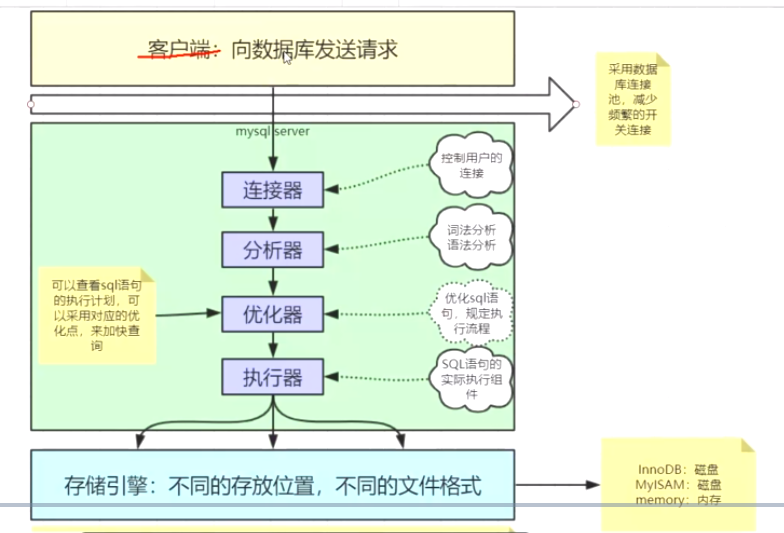

客户端建立连接---server端连接器 密码权限校验----分析器（按照关键字切分，转换为抽象语法树AST）----优化器（RBO、CBO）---执行器（存储引擎）

sql优化：

> IO：减少IO的数据量，减少IO的次数
>
> 避免select *
>
> 缓存：mysql8已经废弃
>
> AST：抽象语法树
>
> RBO：基于规则的优化
>
> CBO: 基于成本的优化 

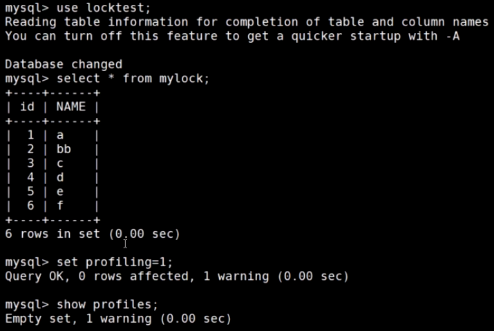

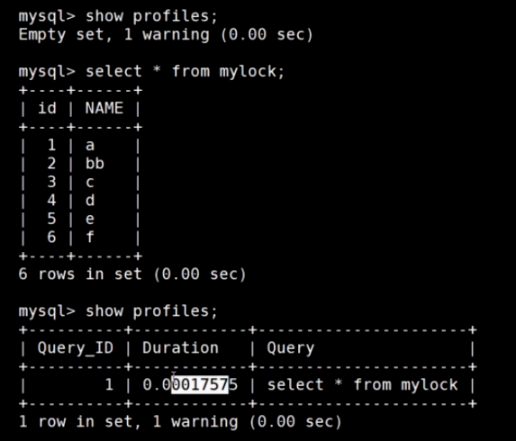

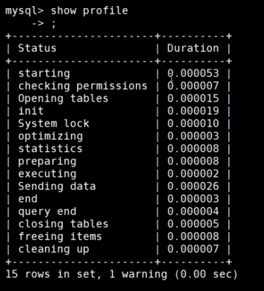

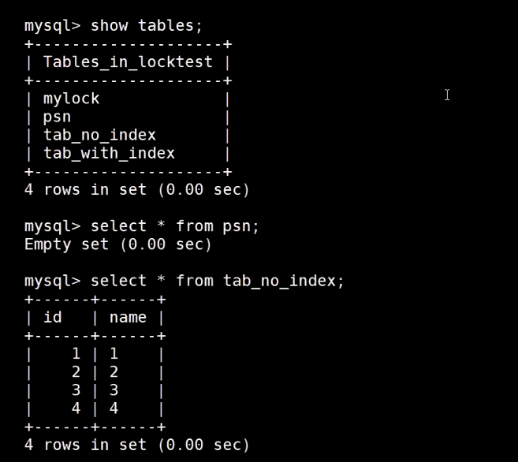

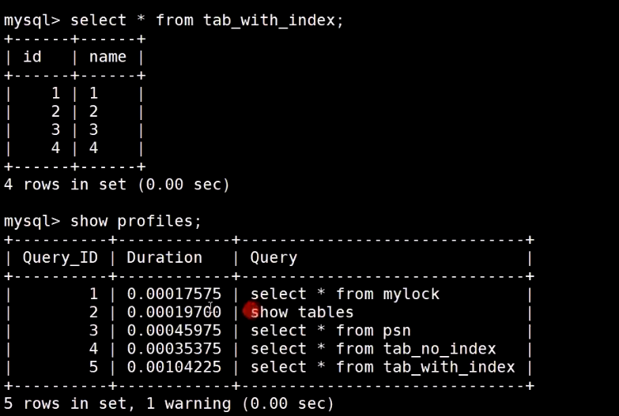

show profile ：显示最后一次执行的sql的时间

show profile for query Query_ID :显示指定的sql语句的执行时间

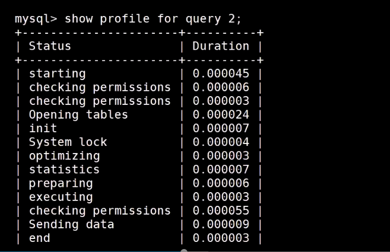

查看cpu的使用情况:show profile cpu

查看所有的属性值：show profile all

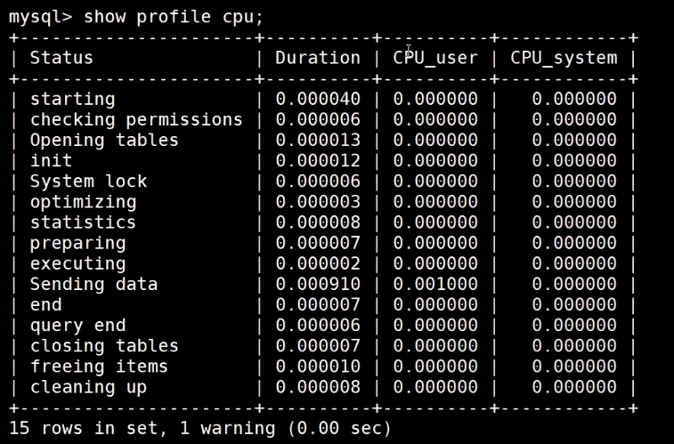

```
SHOW PROFILE的用法：
SHOW PROFILE [type [, type] ... ]
    [FOR QUERY n]
    [LIMIT row_count [OFFSET offset]]

type: {
    ALL
  | BLOCK IO
  | CONTEXT SWITCHES
  | CPU
  | IPC
  | MEMORY
  | PAGE FAULTS
  | SOURCE
  | SWAPS
}
```

```
select * from mylock;
set profiling=1;
select * from mylock;
#显示最后一次sql的执行时间
show profile;
#显示所有的sql执行时间
show profiles;
#根据query_id查看指定的sql的执行时间
show profile for query 90;
#查看cpu的执行时间
show profile cpu;
#查看多个类型的执行时间
show profile cpu,source;
#查看profile的所有类型属性值
show profile all;
```

mysql官网：dev.mysql.com

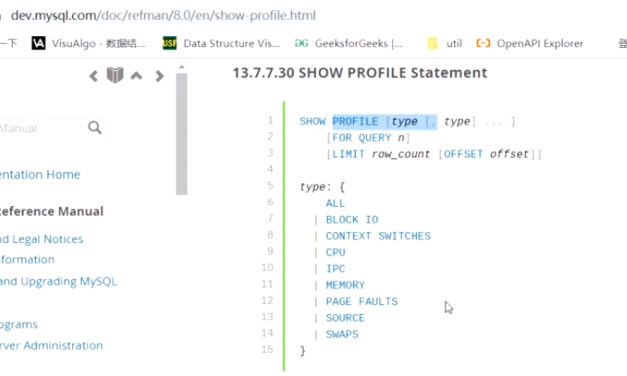


##### 2.使用performance_schema来更加容易的监控mysql

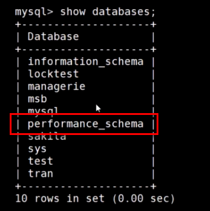

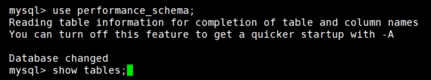

performance_schema:87张表

performance_schema默认会开启，关闭performance_schema需要修改：my.ini配置文件

performance_schema表使用performance_schema存储引擎

在mysql的5.7版本中，性能模式是默认开启的，如果想要显式的关闭的话需要修改配置文件，不能直接进行修改，会报错Variable 'performance_schema' is a read only variable。

```sql
--查看performance_schema的属性
mysql> SHOW VARIABLES LIKE 'performance_schema';
+--------------------+-------+
| Variable_name      | Value |
+--------------------+-------+
| performance_schema | ON    |
+--------------------+-------+
1 row in set (0.01 sec)

--在配置文件中修改performance_schema的属性值，on表示开启，off表示关闭
[mysqld]
performance_schema=ON

--切换数据库
use performance_schema;

--查看当前数据库下的所有表,会看到有很多表存储着相关的信息
show tables;

--可以通过show create table tablename来查看创建表的时候的表结构
mysql> show create table setup_consumers;
+-----------------+---------------------------------
| Table           | Create Table                    
+-----------------+---------------------------------
| setup_consumers | CREATE TABLE `setup_consumers` (
  `NAME` varchar(64) NOT NULL,                      
  `ENABLED` enum('YES','NO') NOT NULL               
) ENGINE=PERFORMANCE_SCHEMA DEFAULT CHARSET=utf8 |  
+-----------------+---------------------------------
1 row in set (0.00 sec)                             
```

​		两个基本概念：

​		instruments: 生产者，用于采集mysql中各种各样的操作产生的事件信息，对应配置表中的配置项我们可以称为监控采集配置项。

​		consumers:消费者，对应的消费者表用于存储来自instruments采集的数据，对应配置表中的配置项我们可以称为消费存储配置项。

### performance_schema的简单配置与使用

​		数据库刚刚初始化并启动时，并非所有instruments(事件采集项，在采集项的配置表中每一项都有一个开关字段，或为YES，或为NO)和consumers(与采集项类似，也有一个对应的事件类型保存表配置项，为YES就表示对应的表保存性能数据，为NO就表示对应的表不保存性能数据)都启用了，所以默认不会收集所有的事件，可能你需要检测的事件并没有打开，需要进行设置，可以使用如下两个语句打开对应的instruments和consumers（行计数可能会因MySQL版本而异)。

```sql
--打开等待事件的采集器配置项开关，需要修改setup_instruments配置表中对应的采集器配置项
UPDATE setup_instruments SET ENABLED = 'YES', TIMED = 'YES'where name like 'wait%';

--打开等待事件的保存表配置开关，修改setup_consumers配置表中对应的配置项
UPDATE setup_consumers SET ENABLED = 'YES'where name like '%wait%';

--当配置完成之后可以查看当前server正在做什么，可以通过查询events_waits_current表来得知，该表中每个线程只包含一行数据，用于显示每个线程的最新监视事件
select * from events_waits_current\G
*************************** 1. row ***************************
            THREAD_ID: 11
             EVENT_ID: 570
         END_EVENT_ID: 570
           EVENT_NAME: wait/synch/mutex/innodb/buf_dblwr_mutex
               SOURCE: 
          TIMER_START: 4508505105239280
            TIMER_END: 4508505105270160
           TIMER_WAIT: 30880
                SPINS: NULL
        OBJECT_SCHEMA: NULL
          OBJECT_NAME: NULL
           INDEX_NAME: NULL
          OBJECT_TYPE: NULL
OBJECT_INSTANCE_BEGIN: 67918392
     NESTING_EVENT_ID: NULL
   NESTING_EVENT_TYPE: NULL
            OPERATION: lock
      NUMBER_OF_BYTES: NULL
                FLAGS: NULL
/*该信息表示线程id为11的线程正在等待buf_dblwr_mutex锁，等待时间为30880
属性说明：
	id:事件来自哪个线程，事件编号是多少
	event_name:表示检测到的具体的内容
	source:表示这个检测代码在哪个源文件中以及行号
	timer_start:表示该事件的开始时间
	timer_end:表示该事件的结束时间
	timer_wait:表示该事件总的花费时间
注意：_current表中每个线程只保留一条记录，一旦线程完成工作，该表中不会再记录该线程的事件信息
*/

/*
_history表中记录每个线程应该执行完成的事件信息，但每个线程的事件信息只会记录10条，再多就会被覆盖，*_history_long表中记录所有线程的事件信息，但总记录数量是10000，超过就会被覆盖掉
*/
select thread_id,event_id,event_name,timer_wait from events_waits_history order by thread_id limit 21;

/*
summary表提供所有事件的汇总信息，该组中的表以不同的方式汇总事件数据（如：按用户，按主机，按线程等等）。例如：要查看哪些instruments占用最多的时间，可以通过对events_waits_summary_global_by_event_name表的COUNT_STAR或SUM_TIMER_WAIT列进行查询（这两列是对事件的记录数执行COUNT（*）、事件记录的TIMER_WAIT列执行SUM（TIMER_WAIT）统计而来）
*/
SELECT EVENT_NAME,COUNT_STAR FROM events_waits_summary_global_by_event_name  ORDER BY COUNT_STAR DESC LIMIT 10;

/*
instance表记录了哪些类型的对象会被检测。这些对象在被server使用时，在该表中将会产生一条事件记录，例如，file_instances表列出了文件I/O操作及其关联文件名
*/
select * from file_instances limit 20; 
```

 #查看生产配置表
 select * from setup_instruments;

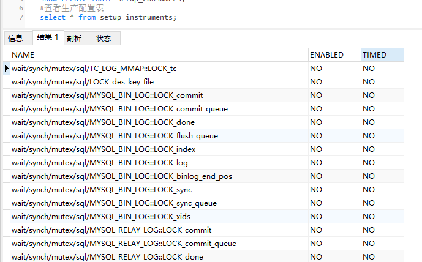

##### 使用show processlist查看连接的客户端


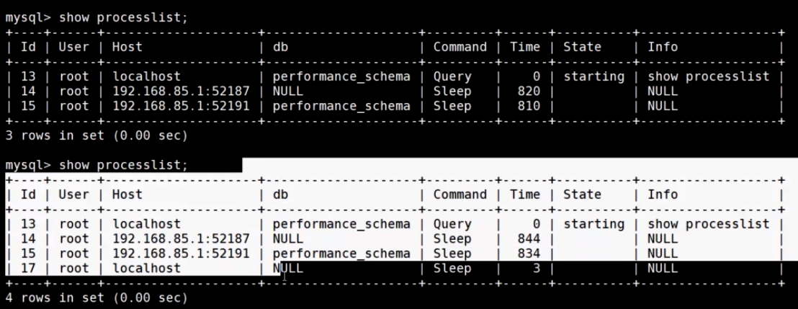

java数据库连接池: c3p0,dbcp,drud(性能最优)

### schema与数据类型优化


##### 更小的通常更好


例子：

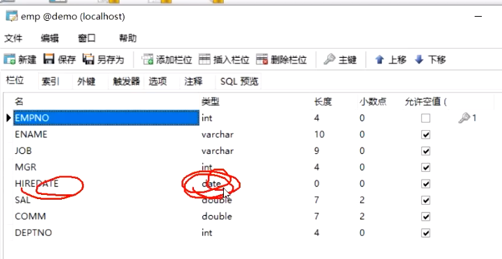

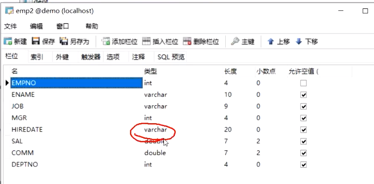

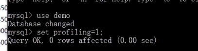

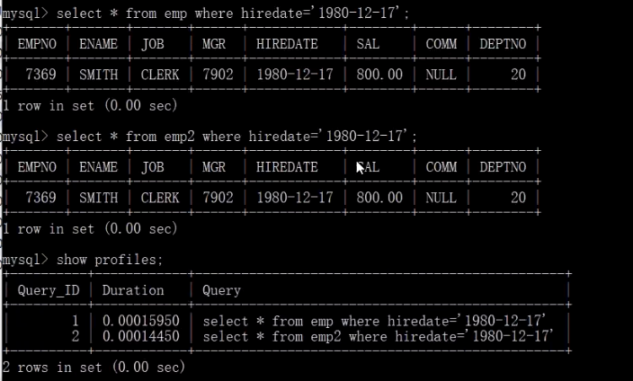

```
 #验证数据类型对查询性能的影响
 select * from emp where hiredate='2021-08-17';
 select * from emp2 where hiredate='2021-08-17';
 show profiles;
```

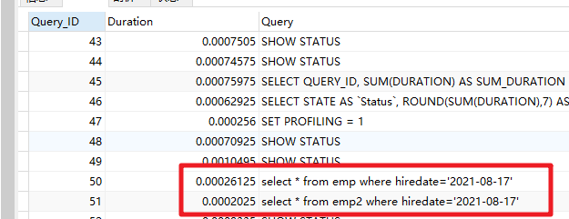

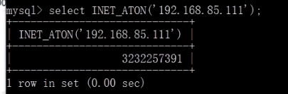

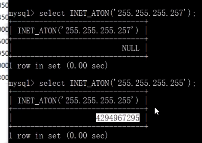

```
 #ip地址可以被转换为int，节约存储空间，但是可读性变差了
select  inet_aton('192.168.25.255')
 3232242175
```

##### 尽量避免null


使用整数类型


##### varchar可变长度存储

磁盘使用4k对齐存储，局部性原理，预加载

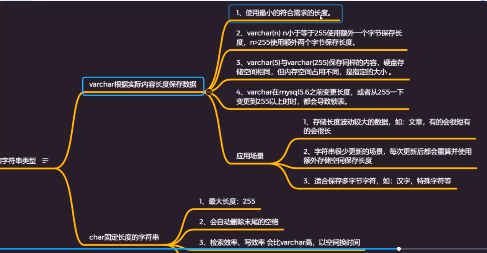


BOB和TEXT类型


使用枚举类型代替字符串

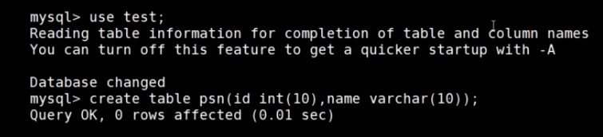

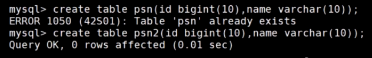

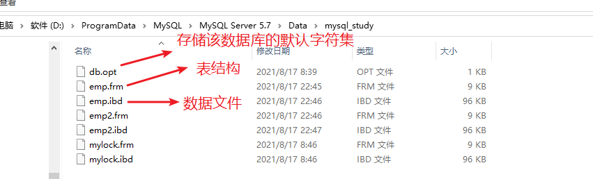

frm:表结构

ibd:innodb的数据文件

**不同的数据类型占用的空间不一样**，整型占用固定的长度，跟表字段指定的长度无关

局部性原理，磁盘预读

磁盘默认的是4kb对齐，所以如果文件大小为4.23kb,则占用两个4kb


