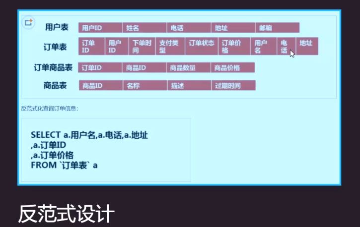
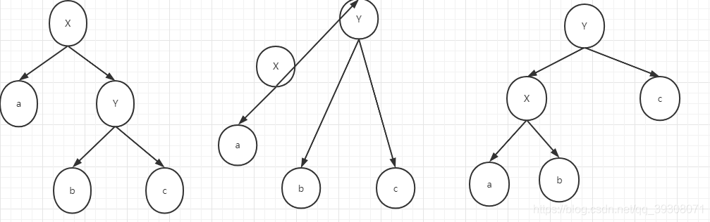

技术名词

>  非聚簇索引：索引和数据存放在不同的文件中

>  聚簇索引：索引和数据存放在同一个文件中

判断表锁还是行锁：如果where条件中的字段都加了索引，则加的是行锁；否则加的是表锁


物化视图：oracle支持，mysql不支持


#### 通过索引进行优化

1. 查看执行计划


id:sql执行的顺序号，如果id相同，按照顺序从上往下执行，如果id不同，id值越大优先级越高

select_type:查询的类型,如子查询，关联查询

type: all表示全表扫描，index表示全索引扫描

possible_key: 可能会用到的索引

key：表示实际使用到的索引

key_len: 索引的长度


书：《淘宝技术这10年》

网站: cs.usfca.edu

mysql：

innodb存储引擎索引使用的是B+tree

memory存储引擎使用的是hash

数据结构：

* hash

   优点：等值查询速度会很快

​    缺点：1.hash没法进行范围查询
​                2.hash查询需要把所有的数据加载到内存中

* 二叉树：

     1. 容易有节点倾斜问题，比如自增数据使用二叉树会退化为链表
        2. 容易造成树的深度过大

* AVL(二叉平衡树)

  在二叉树的基础上，规定左右子树的高度差绝对值不超过1，可以解决二叉树数据倾斜问题

  需要进行左旋右旋来维持树的平衡，旋转浪费时间，插入效率极低，但查询很快

* 红黑树

左旋：逆时针操作，父节点被自己的右孩子取代，而自己成为自己的左孩子

右旋：顺时针操作，父节点被左孩子取代，自己成为自己的右孩子



使用旋转+变色，减少旋转次数，提高插入性能

二叉平衡树的变种，减少旋转的次数，损失一部分查询性能来提高插入数据的效率

无论是二叉树还是红黑树，都会因为树的深度过审而造成IO次数变多，影响数据读取的效率

* B树

B树属于多叉树又名平衡多路查找树（查找路径不只两个）,一棵m阶B树(balanced tree of order m)是一棵平衡的m路搜索树

1.  每个节点最多有m-1个关键字（可以存有的键值对）。

2. 根节点最少可以只有1个关键字。
3. 非根节点至少有m/2个关键字。
4. 每个节点中的关键字都按照从小到大的顺序排列，每个关键字的左子树中的所有关键字都小于它，而右子树中的所有关键字都大于它。
5. 所有叶子节点都位于同一层，或者说根节点到每个叶子节点的长度都相同。
6. 每个节点都存有索引和数据，也就是对应的key和value
   

* B+树

B树的优化，叶子节点直接放置数据，这样非叶子节点可以存放更多的索引。数据量的存储和效率大大提升

B+Tree   文件 -> 偏移量offset -> 指针 -> 指针移动


* B * Tree

是B+树的变体，在B+树的非根和非叶子结点再增加指向兄弟的指针；**B\*-tree**定义了非叶子结点关键字个数至少为*(2/3)\*M*，即块的最低使用率为*2/3*（代替*B+*树的*1/2*）；

技术名词：

> 回表
>
> 当通过非主键索引查询主键以外的其他字段时，通过非主键索引找到对应的主键值，再通过主键索引查询对应的数据
>
> 覆盖索引
>
> 当通过非主键索引只查询主键字段时，通过非主键索引可以直接找到对应的主键值，无需再次回表
>
> **extra字段是using index，意思就是索引覆盖，查询的内容可以直接在索引中拿到**
>
> **extra字段是using where，代表发生了过滤和索引没有直接关系【和是否会表也没有关系】**
>
> 索引下推(mysql5.6开始的)
>
> 在使用非主键索引查询时，如果存在某些被索引的列的判断条件时，根据判断条件把不符合的记录剔除掉，减少回表次数
>
> 最左匹配
>
> 当使用联合索引查询时，只能按照联合索引的顺序从左向右匹配
>
> 索引合并
>
> 当查询单张表可以使用多个索引时，同时扫描多个索引并将扫描结果进行合并(取交集或并集)
>
> 执行计划的type列会显示 index_merge
>
> 索引页分裂
>
> 聚簇索引采用的是平衡二叉树算法，而且每个节点都保存了该主键所对应行的数据，假设插入数据的主键是自增长的，那么根据二叉树算法会很快的把该数据添加到某个节点下，而其他的节点不用动；但是如果插入的是不规则的数据，那么每次插入都会改变二叉树之前的数据状态。从而导致了页分裂。
>
> * 聚簇索引的主键值,应尽量是连续增长的值,而不是要是随机值, (不要用随机字符串或UUID)，否则会造成大量的页分裂与页移动
>
> 索引页合并
>
> 当你删了一行记录时，实际上记录并没有被物理删除，记录被标记（flaged）为删除并且它的空间变得允许被其他记录声明使用。当页中删除的记录达到`MERGE_THRESHOLD`（默认页体积的50%），InnoDB会开始寻找最靠近的页（前或后）看看是否可以将两个页合并以优化空间使用。
>
> 谓词下推
>
> 将过滤条件表达式（=、！=、like、in、between、>、<…）尽量靠近要过滤的数据源，达到尽早过滤无用数据的目的。

# mysql执行计划

​       在企业的应用场景中，为了知道优化SQL语句的执行，需要查看SQL语句的具体执行过程，以加快SQL语句的执行效率。

​       可以使用explain+SQL语句来模拟优化器执行SQL查询语句，从而知道mysql是如何处理sql语句的。

​	   官网地址： https://dev.mysql.com/doc/refman/5.5/en/explain-output.html 

### 1、执行计划中包含的信息

|    Column     |                    Meaning                     |
| :-----------: | :--------------------------------------------: |
|      id       |            The `SELECT` identifier             |
|  select_type  |               The `SELECT` type                |
|     table     |          The table for the output row          |
|  partitions   |            The matching partitions             |
|     type      |                 The join type                  |
| possible_keys |         The possible indexes to choose         |
|      key      |           The index actually chosen            |
|    key_len    |          The length of the chosen key          |
|      ref      |       The columns compared to the index        |
|     rows      |        Estimate of rows to be examined         |
|   filtered    | Percentage of rows filtered by table condition |
|     extra     |             Additional information             |

**id**

select查询的序列号，包含一组数字，表示查询中执行select子句或者操作表的顺序

id号分为三种情况：

​		1、如果id相同，那么执行顺序从上到下

```sql
explain select * from emp e join dept d on e.deptno = d.deptno join salgrade sg on e.sal between sg.losal and sg.hisal;
```

​		2、如果id不同，如果是子查询，id的序号会递增，id值越大优先级越高，越先被执行

```sql
explain select * from emp e where e.deptno in (select d.deptno from dept d where d.dname = 'SALES');
```

​		3、id相同和不同的，同时存在：相同的可以认为是一组，从上往下顺序执行，在所有组中，id值越大，优先级越高，越先执行

```sql
explain select * from emp e join dept d on e.deptno = d.deptno join salgrade sg on e.sal between sg.losal and sg.hisal where e.deptno in (select d.deptno from dept d where d.dname = 'SALES');
```

**select_type**

主要用来分辨查询的类型，是普通查询还是联合查询还是子查询

| `select_type` Value  |                           Meaning                            |
| :------------------: | :----------------------------------------------------------: |
|        SIMPLE        |        Simple SELECT (not using UNION or subqueries)         |
|       PRIMARY        |                       Outermost SELECT                       |
|        UNION         |         Second or later SELECT statement in a UNION          |
|   DEPENDENT UNION    | Second or later SELECT statement in a UNION, dependent on outer query |
|     UNION RESULT     |                      Result of a UNION.                      |
|       SUBQUERY       |                   First SELECT in subquery                   |
|  DEPENDENT SUBQUERY  |      First SELECT in subquery, dependent on outer query      |
|       DERIVED        |                        Derived table                         |
| UNCACHEABLE SUBQUERY | A subquery for which the result cannot be cached and must be re-evaluated for each row of the outer query |
|  UNCACHEABLE UNION   | The second or later select in a UNION that belongs to an uncacheable subquery (see UNCACHEABLE SUBQUERY) |

```sql
--sample:简单的查询，不包含子查询和union
explain select * from emp;

--primary:查询中若包含任何复杂的子查询，最外层查询则被标记为Primary
explain select staname,ename supname from (select ename staname,mgr from emp) t join emp on t.mgr=emp.empno ;

--union:若第二个select出现在union之后，则被标记为union
explain select * from emp where deptno = 10 union select * from emp where sal >2000;

--dependent union:跟union类似，此处的depentent表示union或union all联合而成的结果会受外部表影响
explain select * from emp e where e.empno  in ( select empno from emp where deptno = 10 union select empno from emp where sal >2000)

--union result:从union表获取结果的select
explain select * from emp where deptno = 10 union select * from emp where sal >2000;

--subquery:在select或者where列表中包含子查询
explain select * from emp where sal > (select avg(sal) from emp) ;

--dependent subquery:subquery的子查询要受到外部表查询的影响
explain select * from emp e where e.deptno in (select distinct deptno from dept);

--DERIVED: from子句中出现的子查询，也叫做派生类，
explain select staname,ename supname from (select ename staname,mgr from emp) t join emp on t.mgr=emp.empno ;

--UNCACHEABLE SUBQUERY：表示使用子查询的结果不能被缓存
 explain select * from emp where empno = (select empno from emp where deptno=@@sort_buffer_size);
 
--uncacheable union:表示union的查询结果不能被缓存：sql语句未验证
```

**table**

对应行正在访问哪一个表，表名或者别名，可能是临时表或者union合并结果集
		1、如果是具体的表名，则表明从实际的物理表中获取数据，当然也可以是表的别名

​		2、表名是derivedN的形式，表示使用了id为N的查询产生的衍生表

​		3、当有union result的时候，表名是union n1,n2等的形式，n1,n2表示参与union的id

**type**

type显示的是访问类型，访问类型表示我是以何种方式去访问我们的数据，最容易想的是全表扫描，直接暴力的遍历一张表去寻找需要的数据，效率非常低下，访问的类型有很多，效率从最好到最坏依次是：

system > const > eq_ref > ref > fulltext > ref_or_null > index_merge > unique_subquery > index_subquery > range > index > ALL 

一般情况下，得保证查询至少达到range级别，最好能达到ref

```sql
--all:全表扫描，一般情况下出现这样的sql语句而且数据量比较大的话那么就需要进行优化。
explain select * from emp;

--index：全索引扫描这个比all的效率要好，主要有两种情况，一种是当前的查询时覆盖索引，即我们需要的数据在索引中就可以索取，或者是使用了索引进行排序，这样就避免数据的重排序
explain  select empno from emp;

--range：表示利用索引查询的时候限制了范围，在指定范围内进行查询，这样避免了index的全索引扫描，适用的操作符： =, <>, >, >=, <, <=, IS NULL, BETWEEN, LIKE, or IN() 
explain select * from emp where empno between 7000 and 7500;

--index_subquery：利用索引来关联子查询，不再扫描全表
explain select * from emp where emp.job in (select job from t_job);

--unique_subquery:该连接类型类似与index_subquery,使用的是唯一索引
 explain select * from emp e where e.deptno in (select distinct deptno from dept);
 
--index_merge：在查询过程中需要多个索引组合使用，没有模拟出来

--ref_or_null：对于某个字段即需要关联条件，也需要null值的情况下，查询优化器会选择这种访问方式
explain select * from emp e where  e.mgr is null or e.mgr=7369;

--ref：使用了非唯一性索引进行数据的查找
 create index idx_3 on emp(deptno);
 explain select * from emp e,dept d where e.deptno =d.deptno;

--eq_ref ：使用唯一性索引进行数据查找
explain select * from emp,emp2 where emp.empno = emp2.empno;

--const：这个表至多有一个匹配行，
explain select * from emp where empno = 7369;
 
--system：表只有一行记录（等于系统表），这是const类型的特例，平时不会出现
```

 **possible_keys** 

​        显示可能应用在这张表中的索引，一个或多个，查询涉及到的字段上若存在索引，则该索引将被列出，但不一定被查询实际使用

```sql
explain select * from emp,dept where emp.deptno = dept.deptno and emp.deptno = 10;
```

**key**

​		实际使用的索引，如果为null，则没有使用索引，查询中若使用了覆盖索引，则该索引和查询的select字段重叠。

```sql
explain select * from emp,dept where emp.deptno = dept.deptno and emp.deptno = 10;
```

**key_len**

表示索引中使用的字节数，可以通过key_len计算查询中使用的索引长度，在不损失精度的情况下长度越短越好。

```sql
explain select * from emp,dept where emp.deptno = dept.deptno and emp.deptno = 10;
```

**ref**

显示索引的哪一列被使用了，如果可能的话，是一个常数

```sql
explain select * from emp,dept where emp.deptno = dept.deptno and emp.deptno = 10;
```

**rows**

根据表的统计信息及索引使用情况，大致估算出找出所需记录需要读取的行数，此参数很重要，直接反应的sql找了多少数据，在完成目的的情况下越少越好

```sql
explain select * from emp;
```

**extra**

包含额外的信息。

```sql
--using filesort:说明mysql无法利用索引进行排序，只能利用排序算法进行排序，会消耗额外的位置
explain select * from emp order by sal;

--using temporary:建立临时表来保存中间结果，查询完成之后把临时表删除
explain select ename,count(*) from emp where deptno = 10 group by ename;

--using index:这个表示当前的查询时覆盖索引的，直接从索引中读取数据，而不用访问数据表。如果同时出现using where 表明索引被用来执行索引键值的查找，如果没有，表明索引被用来读取数据，而不是真的查找
explain select deptno,count(*) from emp group by deptno limit 10;

--using where:使用where进行条件过滤
explain select * from t_user where id = 1;

--using join buffer:使用连接缓存，情况没有模拟出来

--impossible where：where语句的结果总是false
explain select * from emp where empno = 7469;
```

