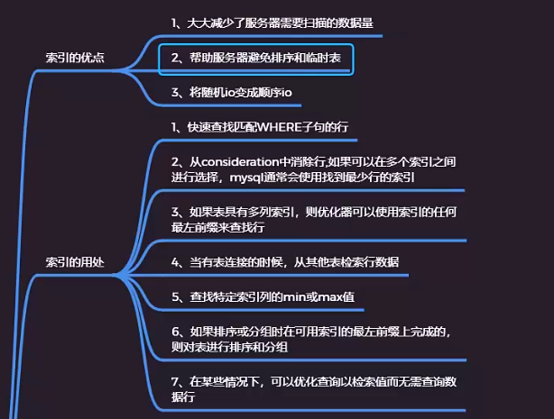
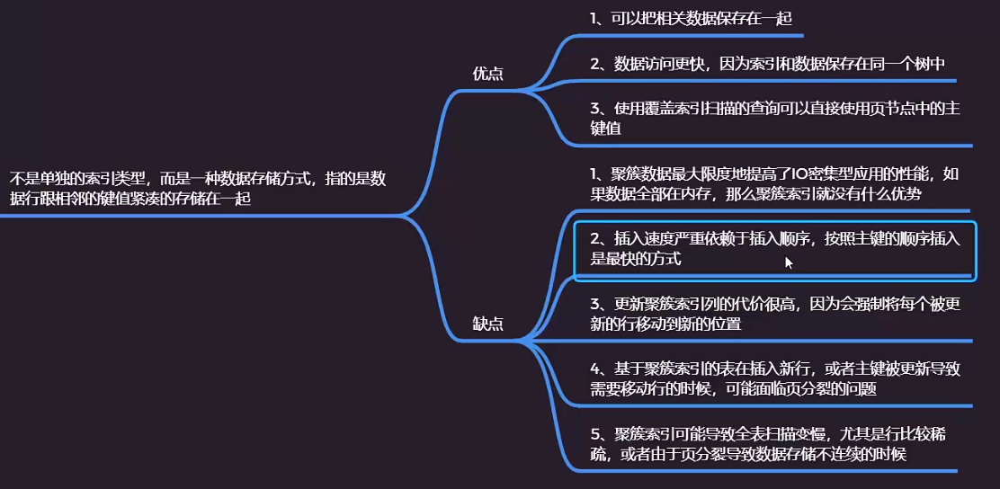
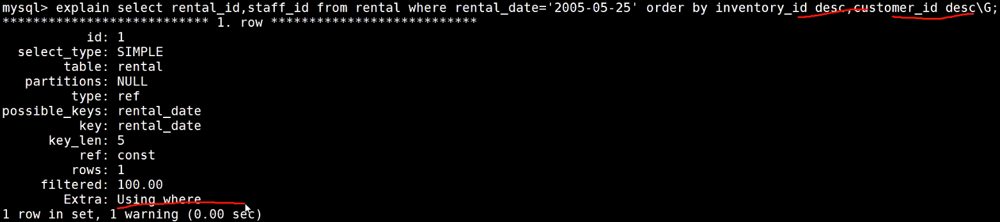

#### 通过索引进行优化




从sql脚本导入数据库:


查看表结构：


```
#创建staffs表
CREATE TABLE `staffs` (
  `id` int(11) NOT NULL,
  `name` varchar(24) CHARACTER SET latin1 NOT NULL DEFAULT '' COMMENT '姓名',
  `age` int(11) NOT NULL COMMENT '年龄',
  `pos` varchar(20) CHARACTER SET latin1 NOT NULL DEFAULT '' COMMENT '职位',
  `add_time` timestamp NOT NULL DEFAULT CURRENT_TIMESTAMP ON UPDATE CURRENT_TIMESTAMP COMMENT '入职时间',
  PRIMARY KEY (`id`)
) ENGINE=InnoDB DEFAULT CHARSET=utf8mb4;
#创建联合索引
alter table staffs add index idx_nap(name,age,pos);
```


pos为字符串，但如果传入数字不加引号不会使用索引


```
#等值查询使用了联合索引
EXPLAIN select * from staffs where name='zhangsan' and age=10 and pos='dev';
#全表扫描不使用索引
explain select * from staffs;
#最左前缀匹配使用了联合索引
explain select * from staffs where name='zhangsan' and age=10;
#最左前缀匹配使用了联合索引
explain select * from staffs where name='zhangsan';
#前缀模糊查询使用了联合索引
explain select * from staffs where name like 'zh%';
#全模糊匹配不使用索引
explain select * from staffs where name like '%an%';
#范围查找会使用索引，但会导致该字段后面的索引列失效
explain select * from staffs where name > 'marry';
explain select * from staffs where name='zhangsan' and age>10;
#pos为字符串，但如果传入数字不加引号不会使用索引
explain select * from staffs where name='zhangsan' and age=10 and pos=12;
explain select * from staffs where name='zhangsan' and pos='12' and age=10 ;
#范围查找导致联合索引后面的索引列失效
explain select * from staffs where name > 'marry' and age=10;
explain select * from staffs where name like 'marry%' and age=10;
explain select * from staffs where name = 'marry' and age=10 and pos >'dev';
```


组合索引中，如果某个字段使用了范围查询会导致这个字段后面的字段索引失效，全模糊匹配也会导致索引失效


聚簇索引优缺点：



数据迁移：迁移前先关闭索引，迁移后再打开索引可以提高导入效率，原因是如果在导入数据过程中维护索引会频繁修改B+树结构影响导入速度


显示表的索引列

```
show index from staffs;
```


#### 优化小细节


```
#索引列使用表达式导致索引失效
explain select * from staffs where name='zhangsan' and age+1=10;
explain select * from staffs where name='zhangsan' and age=10;
```


##### 前缀索引实例说明

前缀索引要注意的问题：使用前缀索引要尽可能降低重复数据，否则索引将会失去意义

有时候需要索引很长的字符串，这会让索引变的大且慢，通常情况下可以使用某个列开始的部分字符串，这样大大的节约索引空间，从而提高索引效率，但这会降低索引的选择性，索引的选择性是指不重复的索引值和数据表记录总数的比值，范围从1/#T到1之间。索引的选择性越高则查询效率越高，因为选择性更高的索引可以让mysql在查找的时候过滤掉更多的行。

​		一般情况下某个列前缀的选择性也是足够高的，足以满足查询的性能，但是对应BLOB,TEXT,VARCHAR类型的列，必须要使用前缀索引，因为mysql不允许索引这些列的完整长度，使用该方法的诀窍在于要选择足够长的前缀以保证较高的选择性，通过又不能太长。

cardinality(基数)：指一个集合中不同值得个数

HyperLogLog算法：统计一组元素中不重复的元素的个数

案例演示：


```sql
--创建数据表
create table citydemo(city varchar(50) not null);
insert into citydemo(city) select city from city;

--重复执行5次下面的sql语句
insert into citydemo(city) select city from citydemo;

--更新城市表的名称
update citydemo set city=(select city from city order by rand() limit 1);

--查找最常见的城市列表，发现每个值都出现45-65次，
select count(*) as cnt,city from citydemo group by city order by cnt desc limit 10;

--查找最频繁出现的城市前缀，先从3个前缀字母开始，发现比原来出现的次数更多，可以分别截取多个字符查看城市出现的次数
select count(*) as cnt,left(city,3) as pref from citydemo group by pref order by cnt desc limit 10;
select count(*) as cnt,left(city,7) as pref from citydemo group by pref order by cnt desc limit 10;
--此时前缀的选择性接近于完整列的选择性

--还可以通过另外一种方式来计算完整列的选择性，可以看到当前缀长度到达7之后，再增加前缀长度，选择性提升的幅度已经很小了
select count(distinct left(city,3))/count(*) as sel3,
count(distinct left(city,4))/count(*) as sel4,
count(distinct left(city,5))/count(*) as sel5,
count(distinct left(city,6))/count(*) as sel6,
count(distinct left(city,7))/count(*) as sel7,
count(distinct left(city,8))/count(*) as sel8 
from citydemo;

--计算完成之后可以创建前缀索引
alter table citydemo add key(city(7));
show index from citydemo;
--注意：前缀索引是一种能使索引更小更快的有效方法，但是也包含缺点：mysql无法使用前缀索引做order by 和 group by。 
```


extra: using filesort表示使用文件排序

rental_date,inventory_id,customer_id为组合索引

当创建组合索引的时候，组合索引默认是按照升序排序，所以order by一个为升序一个为降序则无法使用索引排序


```
#使用组合索引排序,排序的方向不一致无法使用索引
explain select rental_id,staff_id from rental where rental_date='2005-05-25' order by inventory_id desc,customer_id asc ;
#使用了索引排序
explain select rental_id,staff_id from rental where rental_date='2005-05-25' order by inventory_id asc,customer_id asc ;
explain select rental_id,staff_id from rental where rental_date='2005-05-25' order by inventory_id desc,customer_id desc ;
#使用了范围查询后，会导致组合索引后面的索引列失效
explain select rental_id,staff_id from rental where rental_date>'2005-05-25' order by inventory_id asc,customer_id asc ;
#order by 包含不属于索引的列，无法使用索引排序
explain select rental_id,staff_id from rental where rental_date='2005-05-25' order by inventory_id asc,staff_id asc ;
```

使用了索引排序：


使用了范围查询后，会导致该列对应组合索引的其他索引列失效


使用了索引排序：



未使用索引排序：staff_id不属于索引列


思维导图 xmind:zen 2020

