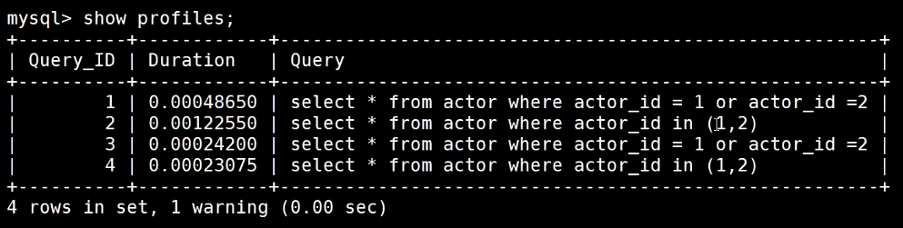

查询效率：in>or,union




exists: 通过外层限制内层所取的值


强制类型转换会导致索引失效：


join的内部实现：


join: 小表匹配大表效率更高

map join： 小表放内存，join大表

##### MYSQL join..on 后的and 和where的区别
1.where 是在两个表join完成后，再附上where条件

2.而 and 则是在表连接前过滤A表或B表里面哪些记录符合连接条件，同时会兼顾是left join还是right join。即
假如是左连接的话，如果左边表的某条记录不符合连接条件，那么它不进行连接，但是仍然留在结果集中（此时右边部分的连接结果为NULL）。on条件是在生成临时表时使用的条件，它不管on中的条件是否为真，都会返回左边表中的记录。

3.建议尽量用where来过滤条件

##### 索引监控

```
show status like 'Handler_read%';
```

Handler_read_key和Handler_read_rnd_next值越大表示索引被使用的越多


