#### 查询优化


1. 查询数据量大(数据量达到表的30%)时mysql不会使用索引排序：

```
#查询数据量大时，mysql不会使用索引排序，而是直接使用文件排序
select count(*) from rental where rental_date>'2005-05-25';
explain select * from rental where rental_date>'2005-05-25' order by rental_date,inventory_id;
select count(*) from rental where rental_date>'2006-01-25';
explain select * from rental where rental_date>'2006-01-25' order by rental_date,inventory_id;
```

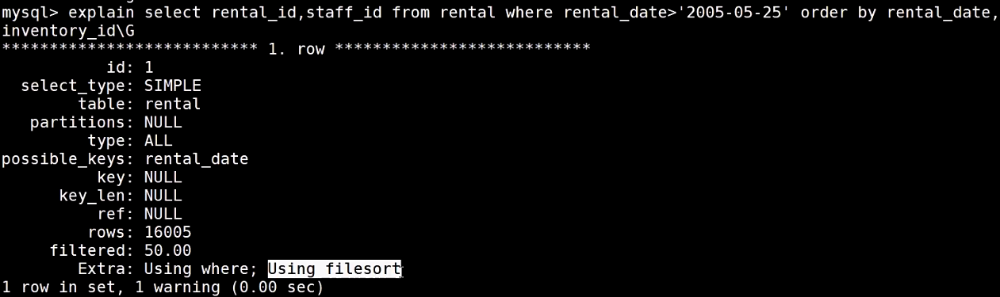

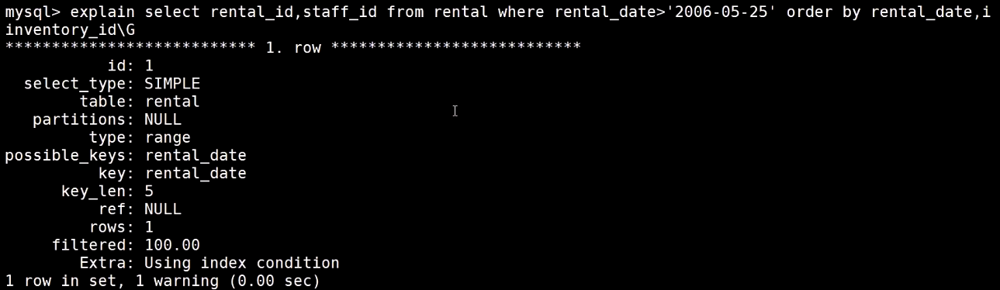

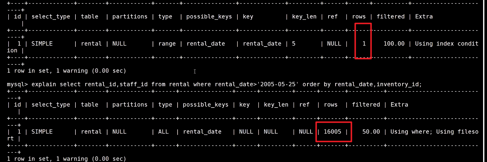

2. 使用子查询来提高查询效率：

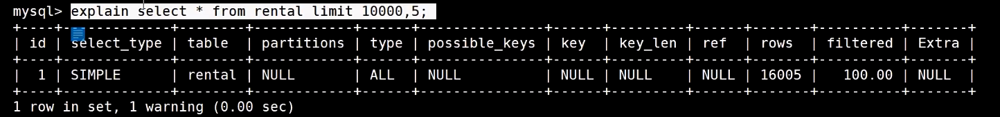

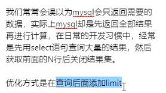

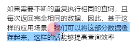


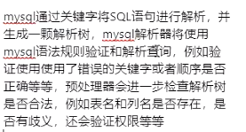

sql解析工具：apache calcite

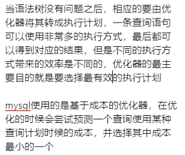


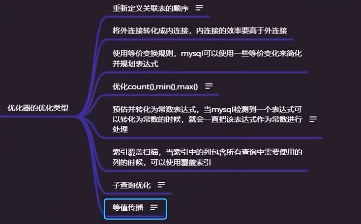

内连接获取的数据量比外连接要少


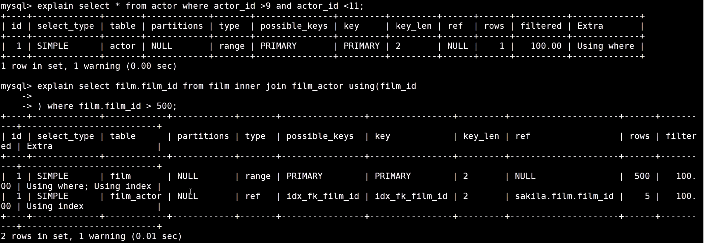

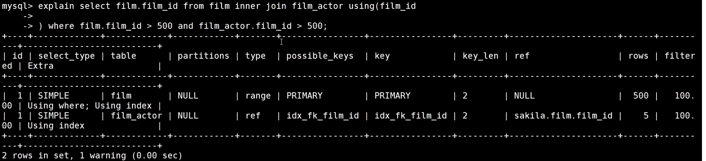

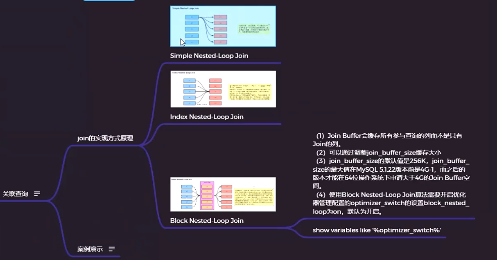

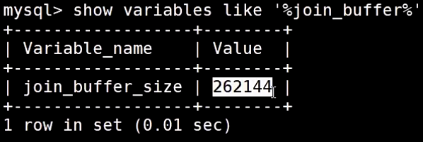


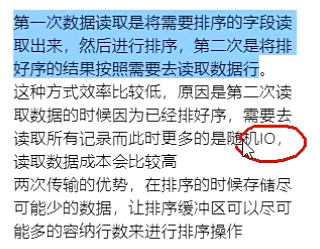

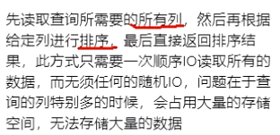

查询最后一次执行sql遍历的行数：show status like 'last_query_cost';

MySQL中可以通过show status like 'last_query_cost' 来查看查上一个查询的代价，而且它是io_cost和cpu_cost的开销总和，它通常也是我们评价一个查询的执行效率的一个常用指标。

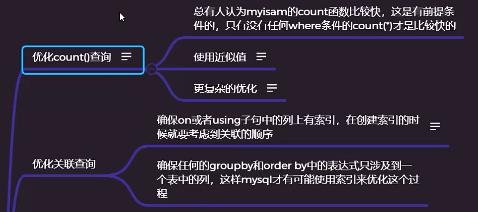

count(*),count(id),count(1)这三个方式查询效率没有区别

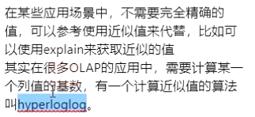

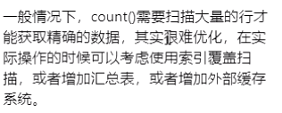

##### 优化子查询


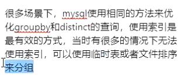


##### 推荐使用用户自定义变量

@符号开头表示用户自定义变量，两个@符号表示系统变量

自定义变量可以用在sql语句中，当前会话有效

```
set @film_id:=10;
select * from film where film_id=@film_id;
```

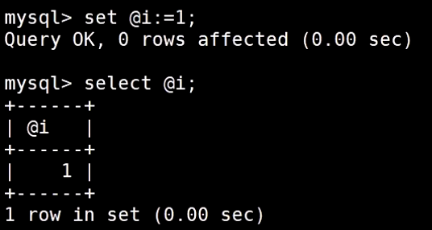

