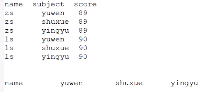
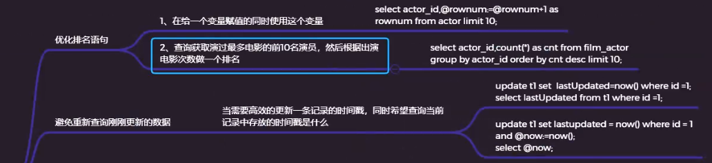
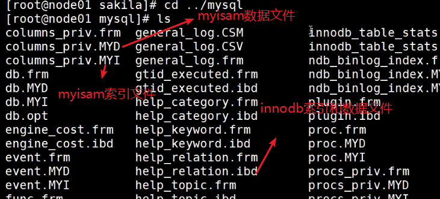
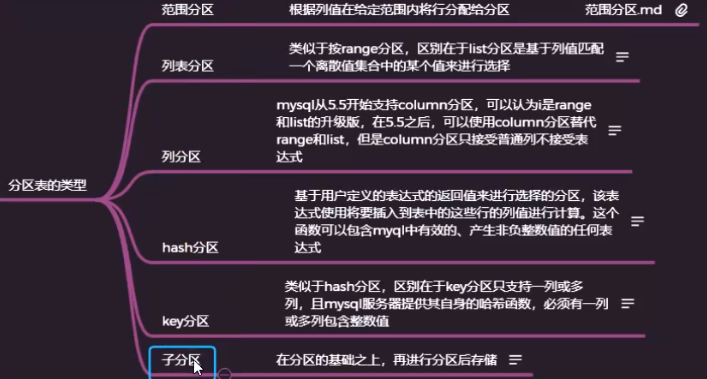
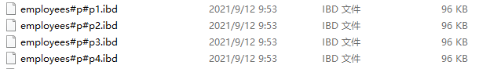
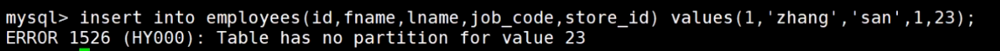
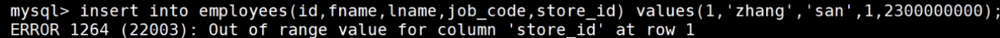
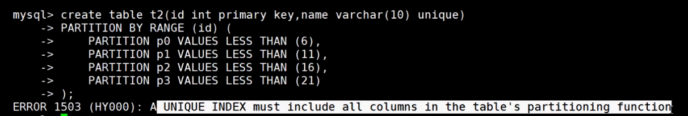
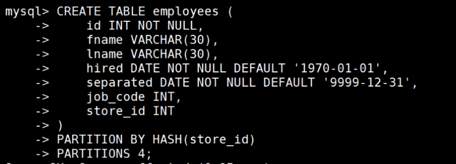

#### 优化查询


行转列：

>oracle: join union decode case when
>
>mysql: join union case when



```
CREATE TABLE `tb_socre` (
  `id` int(11) NOT NULL AUTO_INCREMENT,
  `name` varchar(50) DEFAULT NULL,
  `subject` varchar(50) DEFAULT NULL,
  `score` int(10) DEFAULT NULL,
  PRIMARY KEY (`id`)
) ENGINE=InnoDB AUTO_INCREMENT=7 DEFAULT CHARSET=utf8mb4;
INSERT INTO `tb_socre`(`id`, `name`, `subject`, `score`) VALUES (1, 'zs', 'yuwen', 89);
INSERT INTO `tb_socre`(`id`, `name`, `subject`, `score`) VALUES (2, 'zs', 'shuxue', 50);
INSERT INTO `tb_socre`(`id`, `name`, `subject`, `score`) VALUES (3, 'zs', 'yingyu', 60);
INSERT INTO `tb_socre`(`id`, `name`, `subject`, `score`) VALUES (4, 'ls', 'yuwen', 70);
INSERT INTO `tb_socre`(`id`, `name`, `subject`, `score`) VALUES (5, 'ls', 'shuxue', 60);
INSERT INTO `tb_socre`(`id`, `name`, `subject`, `score`) VALUES (6, 'ls', 'yingyu', 80);
```

```
#行转列
select t.name,(select score from tb_socre where name=t.name and subject='yuwen') yuwen,(select score from tb_socre where name=t.name and subject='shuxue') shuxue,(select score from tb_socre where name=t.name and subject='yingyu') yingyu from tb_socre  t GROUP BY t.name;

#case when
select name, sum(case subject when 'yuwen'  then score end) yuwen,sum(case subject when 'shuxue'  then score end) shuxue,sum(case subject when 'yingyu'  then score end) yingyu from tb_socre group by name;

#join on
select yuwen_score.name,yuwen_score.score yuwen,shuxue_score.score shuxue,yingyu_score.score yingyu
from (select name,score from tb_socre where SUBJECT='yuwen')  yuwen_score
inner join 
(select name,score from tb_socre where SUBJECT='shuxue') shuxue_score
on yuwen_score.name=shuxue_score.name
inner join 
(select name,score from tb_socre where SUBJECT='yingyu') yingyu_score
on shuxue_score.name=yingyu_score.name;

#join using
select yuwen_score.name,yuwen_score.score yuwen,shuxue_score.score shuxue,yingyu_score.score yingyu
from (select name,score from tb_socre where SUBJECT='yuwen')  yuwen_score
inner join 
(select name,score from tb_socre where SUBJECT='shuxue') shuxue_score
using(name)
inner join 
(select name,score from tb_socre where SUBJECT='yingyu') yingyu_score
using(name);
```





#### 分区表

将一个表分为多个文件存储，在存储目录中文件名以#开头




#### 分区表的底层原理

#### 分区表的类型



##### 范围分区

范围分区表的分区方式是：每个分区都包含行数据且分区的表达式在给定的范围内，分区的范围应该是连续的且不能重叠，可以使用values less than运算符来定义。

​		1、创建普通的表

```sql
CREATE TABLE employees (
    id INT NOT NULL,
    fname VARCHAR(30),
    lname VARCHAR(30),
    hired DATE NOT NULL DEFAULT '1970-01-01',
    separated DATE NOT NULL DEFAULT '9999-12-31',
    job_code INT NOT NULL,
    store_id INT NOT NULL
);
```

​		2、创建带分区的表，下面建表的语句是按照store_id来进行分区的，指定了4个分区

```sql
CREATE TABLE employees (
    id INT NOT NULL,
    fname VARCHAR(30),
    lname VARCHAR(30),
    hired DATE NOT NULL DEFAULT '1970-01-01',
    separated DATE NOT NULL DEFAULT '9999-12-31',
    job_code INT NOT NULL,
    store_id INT NOT NULL
)
PARTITION BY RANGE (store_id) (
    PARTITION p0 VALUES LESS THAN (6),
    PARTITION p1 VALUES LESS THAN (11),
    PARTITION p2 VALUES LESS THAN (16),
    PARTITION p3 VALUES LESS THAN (21)
);
--在当前的建表语句中可以看到，store_id的值在1-5的在p0分区，6-10的在p1分区，11-15的在p3分区，16-20的在p4分区，但是如果插入超过20的值就会报错，因为mysql不知道将数据放在哪个分区
```

	

超过分区范围数据无法存储：

	

3、可以使用less than maxvalue来避免此种情况

```sql
CREATE TABLE employees (
    id INT NOT NULL,
    fname VARCHAR(30),
    lname VARCHAR(30),
    hired DATE NOT NULL DEFAULT '1970-01-01',
    separated DATE NOT NULL DEFAULT '9999-12-31',
    job_code INT NOT NULL,
    store_id INT NOT NULL
)
PARTITION BY RANGE (store_id) (
    PARTITION p0 VALUES LESS THAN (6),
    PARTITION p1 VALUES LESS THAN (11),
    PARTITION p2 VALUES LESS THAN (16),
    PARTITION p3 VALUES LESS THAN MAXVALUE
);
--maxvalue表示始终大于等于最大可能整数值的整数值
```

超过最大值范围：





4、可以使用相同的方式根据员工的职务代码对表进行分区

```sql
CREATE TABLE employees (
    id INT NOT NULL,
    fname VARCHAR(30),
    lname VARCHAR(30),
    hired DATE NOT NULL DEFAULT '1970-01-01',
    separated DATE NOT NULL DEFAULT '9999-12-31',
    job_code INT NOT NULL,
    store_id INT NOT NULL
)
PARTITION BY RANGE (job_code) (
    PARTITION p0 VALUES LESS THAN (100),
    PARTITION p1 VALUES LESS THAN (1000),
    PARTITION p2 VALUES LESS THAN (10000)
);
```

​		5、可以使用date类型进行分区：如需要根据每个员工离开公司的年份进行划分，如year(separated)

```sql
CREATE TABLE employees (
    id INT NOT NULL,
    fname VARCHAR(30),
    lname VARCHAR(30),
    hired DATE NOT NULL DEFAULT '1970-01-01',
    separated DATE NOT NULL DEFAULT '9999-12-31',
    job_code INT,
    store_id INT
)
PARTITION BY RANGE ( YEAR(separated) ) (
    PARTITION p0 VALUES LESS THAN (1991),
    PARTITION p1 VALUES LESS THAN (1996),
    PARTITION p2 VALUES LESS THAN (2001),
    PARTITION p3 VALUES LESS THAN MAXVALUE
);
```

​		6、可以使用函数根据range的值来对表进行分区，如timestampunix_timestamp()

```sql
CREATE TABLE quarterly_report_status (
    report_id INT NOT NULL,
    report_status VARCHAR(20) NOT NULL,
    report_updated TIMESTAMP NOT NULL DEFAULT CURRENT_TIMESTAMP ON UPDATE CURRENT_TIMESTAMP
)
PARTITION BY RANGE ( UNIX_TIMESTAMP(report_updated) ) (
    PARTITION p0 VALUES LESS THAN ( UNIX_TIMESTAMP('2008-01-01 00:00:00') ),
    PARTITION p1 VALUES LESS THAN ( UNIX_TIMESTAMP('2008-04-01 00:00:00') ),
    PARTITION p2 VALUES LESS THAN ( UNIX_TIMESTAMP('2008-07-01 00:00:00') ),
    PARTITION p3 VALUES LESS THAN ( UNIX_TIMESTAMP('2008-10-01 00:00:00') ),
    PARTITION p4 VALUES LESS THAN ( UNIX_TIMESTAMP('2009-01-01 00:00:00') ),
    PARTITION p5 VALUES LESS THAN ( UNIX_TIMESTAMP('2009-04-01 00:00:00') ),
    PARTITION p6 VALUES LESS THAN ( UNIX_TIMESTAMP('2009-07-01 00:00:00') ),
    PARTITION p7 VALUES LESS THAN ( UNIX_TIMESTAMP('2009-10-01 00:00:00') ),
    PARTITION p8 VALUES LESS THAN ( UNIX_TIMESTAMP('2010-01-01 00:00:00') ),
    PARTITION p9 VALUES LESS THAN (MAXVALUE)
);
--timestamp不允许使用任何其他涉及值的表达式
```

基于时间间隔的分区方案，在mysql5.7中，可以基于范围或事件间隔实现分区方案，有两种选择

1、基于范围的分区，对于分区表达式，可以使用操作函数基于date、time、或者datatime列来返回一个整数值

```sql
CREATE TABLE members (
    firstname VARCHAR(25) NOT NULL,
    lastname VARCHAR(25) NOT NULL,
    username VARCHAR(16) NOT NULL,
    email VARCHAR(35),
    joined DATE NOT NULL
)
PARTITION BY RANGE( YEAR(joined) ) (
    PARTITION p0 VALUES LESS THAN (1960),
    PARTITION p1 VALUES LESS THAN (1970),
    PARTITION p2 VALUES LESS THAN (1980),
    PARTITION p3 VALUES LESS THAN (1990),
    PARTITION p4 VALUES LESS THAN MAXVALUE
);

CREATE TABLE quarterly_report_status (
    report_id INT NOT NULL,
    report_status VARCHAR(20) NOT NULL,
    report_updated TIMESTAMP NOT NULL DEFAULT CURRENT_TIMESTAMP ON UPDATE CURRENT_TIMESTAMP
)
PARTITION BY RANGE ( UNIX_TIMESTAMP(report_updated) ) (
    PARTITION p0 VALUES LESS THAN ( UNIX_TIMESTAMP('2008-01-01 00:00:00') ),
    PARTITION p1 VALUES LESS THAN ( UNIX_TIMESTAMP('2008-04-01 00:00:00') ),
    PARTITION p2 VALUES LESS THAN ( UNIX_TIMESTAMP('2008-07-01 00:00:00') ),
    PARTITION p3 VALUES LESS THAN ( UNIX_TIMESTAMP('2008-10-01 00:00:00') ),
    PARTITION p4 VALUES LESS THAN ( UNIX_TIMESTAMP('2009-01-01 00:00:00') ),
    PARTITION p5 VALUES LESS THAN ( UNIX_TIMESTAMP('2009-04-01 00:00:00') ),
    PARTITION p6 VALUES LESS THAN ( UNIX_TIMESTAMP('2009-07-01 00:00:00') ),
    PARTITION p7 VALUES LESS THAN ( UNIX_TIMESTAMP('2009-10-01 00:00:00') ),
    PARTITION p8 VALUES LESS THAN ( UNIX_TIMESTAMP('2010-01-01 00:00:00') ),
    PARTITION p9 VALUES LESS THAN (MAXVALUE)
);
```

2、基于范围列的分区，使用date或者datatime列作为分区列

```sql
CREATE TABLE members (
    firstname VARCHAR(25) NOT NULL,
    lastname VARCHAR(25) NOT NULL,
    username VARCHAR(16) NOT NULL,
    email VARCHAR(35),
    joined DATE NOT NULL
)
PARTITION BY RANGE COLUMNS(joined) (
    PARTITION p0 VALUES LESS THAN ('1960-01-01'),
    PARTITION p1 VALUES LESS THAN ('1970-01-01'),
    PARTITION p2 VALUES LESS THAN ('1980-01-01'),
    PARTITION p3 VALUES LESS THAN ('1990-01-01'),
    PARTITION p4 VALUES LESS THAN MAXVALUE
);
```

### 		真实案例：

```sql
#不分区的表
CREATE TABLE no_part_tab
(id INT DEFAULT NULL,
remark VARCHAR(50) DEFAULT NULL,
d_date DATE DEFAULT NULL
)ENGINE=MYISAM;
#分区的表
CREATE TABLE part_tab
(id INT DEFAULT NULL,
remark VARCHAR(50) DEFAULT NULL,
d_date DATE DEFAULT NULL
)ENGINE=MYISAM
PARTITION BY RANGE(YEAR(d_date))(
PARTITION p0 VALUES LESS THAN(1995),
PARTITION p1 VALUES LESS THAN(1996),
PARTITION p2 VALUES LESS THAN(1997),
PARTITION p3 VALUES LESS THAN(1998),
PARTITION p4 VALUES LESS THAN(1999),
PARTITION p5 VALUES LESS THAN(2000),
PARTITION p6 VALUES LESS THAN(2001),
PARTITION p7 VALUES LESS THAN(2002),
PARTITION p8 VALUES LESS THAN(2003),
PARTITION p9 VALUES LESS THAN(2004),
PARTITION p10 VALUES LESS THAN maxvalue);
#插入未分区表记录
DROP PROCEDURE IF EXISTS no_load_part;
 

DELIMITER//
CREATE PROCEDURE no_load_part()
BEGIN
    DECLARE i INT;
    SET i =1;
    WHILE i<80001
    DO
    INSERT INTO no_part_tab VALUES(i,'no',ADDDATE('1995-01-01',(RAND(i)*36520) MOD 3652));
    SET i=i+1;
    END WHILE;
END//
DELIMITER ;
 
CALL no_load_part;
#插入分区表记录
DROP PROCEDURE IF EXISTS load_part;
 
DELIMITER&& 
CREATE PROCEDURE load_part()
BEGIN
    DECLARE i INT;
    SET i=1;
    WHILE i<80001
    DO
    INSERT INTO part_tab VALUES(i,'partition',ADDDATE('1995-01-01',(RAND(i)*36520) MOD 3652));
    SET i=i+1;
    END WHILE;
END&&
DELIMITER ;
 
CALL load_part;
```



##### 列表分区

在列表分区中，每个分区是根据一组值比如列表中的一个或多个列值的成员来定义和选择的，而不是根据一组连续范围的一个列值。这是通过使用where 是列值或基于列值的表达式并返回整数值，然后通过 a 定义每个分区来完成的 ，其中 是逗号分隔的整数列表。 `PARTITION BY LIST(*`expr`*)`*`expr`*`VALUES IN (*`value_list`*)`*`value_list`*

```
CREATE TABLE employees (
    id INT NOT NULL,
    fname VARCHAR(30),
    lname VARCHAR(30),
    hired DATE NOT NULL DEFAULT '1970-01-01',
    separated DATE NOT NULL DEFAULT '9999-12-31',
    job_code INT,
    store_id INT
)
PARTITION BY LIST(store_id) (
    PARTITION pNorth VALUES IN (3,5,6,9,17),
    PARTITION pEast VALUES IN (1,2,10,11,19,20),
    PARTITION pWest VALUES IN (4,12,13,14,18),
    PARTITION pCentral VALUES IN (7,8,15,16)
);
```

##### 列分区

`COLUMNS` partitioning，它们是`RANGE`和`LIST` partitioning 的变体 。`COLUMNS`分区允许在分区键中使用多列。为了在分区中放置行以及确定要检查哪些分区以在分区修剪中匹配行，所有这些列都被考虑在内。

此外，`RANGE COLUMNS`分区和`LIST COLUMNS`分区都支持使用非整数列来定义值范围或列表成员。允许的数据类型如下表所示：

- 所有整数类型：[`TINYINT`](https://dev.mysql.com/doc/refman/8.0/en/integer-types.html)、 [`SMALLINT`](https://dev.mysql.com/doc/refman/8.0/en/integer-types.html)、 [`MEDIUMINT`](https://dev.mysql.com/doc/refman/8.0/en/integer-types.html)、 [`INT`](https://dev.mysql.com/doc/refman/8.0/en/integer-types.html) ( [`INTEGER`](https://dev.mysql.com/doc/refman/8.0/en/integer-types.html)) 和 [`BIGINT`](https://dev.mysql.com/doc/refman/8.0/en/integer-types.html)。（这是相同的，与通过分割`RANGE`和 `LIST`）。

  不支持 其他数字数据类型（例如 [`DECIMAL`](https://dev.mysql.com/doc/refman/8.0/en/fixed-point-types.html)或 [`FLOAT`](https://dev.mysql.com/doc/refman/8.0/en/floating-point-types.html)）作为分区列。

- [`DATE`](https://dev.mysql.com/doc/refman/8.0/en/datetime.html)和 [`DATETIME`](https://dev.mysql.com/doc/refman/8.0/en/datetime.html)。

  不支持使用与日期或时间相关的其他数据类型的列作为分区列。

- 下面的字符串类型： [`CHAR`](https://dev.mysql.com/doc/refman/8.0/en/char.html)， [`VARCHAR`](https://dev.mysql.com/doc/refman/8.0/en/char.html)， [`BINARY`](https://dev.mysql.com/doc/refman/8.0/en/binary-varbinary.html)，和 [`VARBINARY`](https://dev.mysql.com/doc/refman/8.0/en/binary-varbinary.html)。

  [`TEXT`](https://dev.mysql.com/doc/refman/8.0/en/blob.html)和 [`BLOB`](https://dev.mysql.com/doc/refman/8.0/en/blob.html)列不支持作为分区列。

```
#范围列分区
drop table if exists employees ;
CREATE TABLE employees (
    id INT NOT NULL,
    fname VARCHAR(30),
    lname VARCHAR(30),
    hired DATE NOT NULL DEFAULT '1970-01-01',
    separated DATE NOT NULL DEFAULT '9999-12-31',
    job_code INT NOT NULL,
    store_id INT NOT NULL
)
partition by range COLUMNS(store_id,job_code)(
partition p1 values less than (6,10),
partition p2 values less than (12,15),
partition p3 values less than (18,20),
partition p4 values less than (MAXVALUE,MAXVALUE)
);
#列表列分区
drop table if exists employees ;
CREATE TABLE employees (
    id INT NOT NULL,
    fname VARCHAR(30),
    lname VARCHAR(30),
    hired DATE NOT NULL DEFAULT '1970-01-01',
    separated DATE NOT NULL DEFAULT '9999-12-31',
    job_code INT NOT NULL,
    store_id INT NOT NULL
)
partition by LIST COLUMNS(store_id,job_code)(
partition p1 values in ((6,10),(11,20)),
partition p2 values in ((16,110),(111,120)),
partition p3 values in ((26,210),(211,220))
);
```

##### HASH 分区

分区依据`HASH`主要用于确保数据在预定数量的分区之间均匀分布。对于范围或列表分区，您必须明确指定给定的列值或列值集应该存储在哪个分区中；使用散列分区，您只需要根据要散列的列值和分区表要划分的分区数指定列值或表达式。

要使用分区对表进行`HASH`分区，必须在[`CREATE TABLE`](https://dev.mysql.com/doc/refman/8.0/en/create-table.html)语句后附加一个子句，其中 是一个返回整数的表达式。这可以是一个列的名称，其类型是MySQL的整数类型之一。此外，您很可能希望在后面加上正整数，表示要将表划分为的分区数。 `PARTITION BY HASH (*`expr`*)`*`expr`*`PARTITIONS *`num`*`*`num`*

```
drop table if exists employees ;
CREATE TABLE employees (
    id INT NOT NULL,
    fname VARCHAR(30),
    lname VARCHAR(30),
    hired DATE NOT NULL DEFAULT '1970-01-01',
    separated DATE NOT NULL DEFAULT '9999-12-31',
    job_code INT,
    store_id INT
)
PARTITION BY HASH(store_id)
PARTITIONS 4;
#使用store_id对4进行取模运算得到数据应该存放的分区
```

##### key分区

KEY分区和HASH分区相似，但是KEY分区支持除text和BLOB之外的所有数据类型的分区，而HASH分区只支持数字分区，KEY分区不允许使用用户自定义的表达式进行分区，KEY分区使用系统提供的HASH函数进行分区。当表中存在主键或者唯一键时，如果创建key分区时没有指定字段系统默认会首选主键列作为分区字列,如果不存在主键列会选择非空唯一键列作为分区列,注意唯一列作为分区列唯一列不能为null。

```
CREATE TABLE tb_key (
    id INT ,
    var CHAR(32) 
)
PARTITION BY KEY(var)
PARTITIONS 10;
```

##### 子分区

子分区（也称为 复合分区）是对分区表中每个分区的进一步划分。

```
#先按照年份分为3个分区(范围)，在每个分区上再按照天分为两个分区(hash)
CREATE TABLE ts (id INT, purchased DATE)
    PARTITION BY RANGE( YEAR(purchased) )
    SUBPARTITION BY HASH( TO_DAYS(purchased) )
    SUBPARTITIONS 2 (
        PARTITION p0 VALUES LESS THAN (1990),
        PARTITION p1 VALUES LESS THAN (2000),
        PARTITION p2 VALUES LESS THAN MAXVALUE
    );
```

