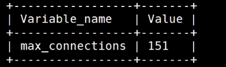
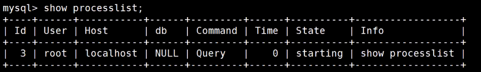
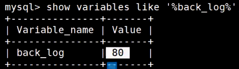
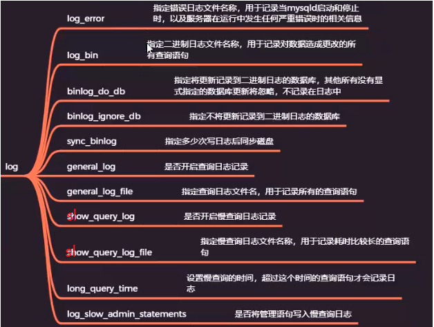
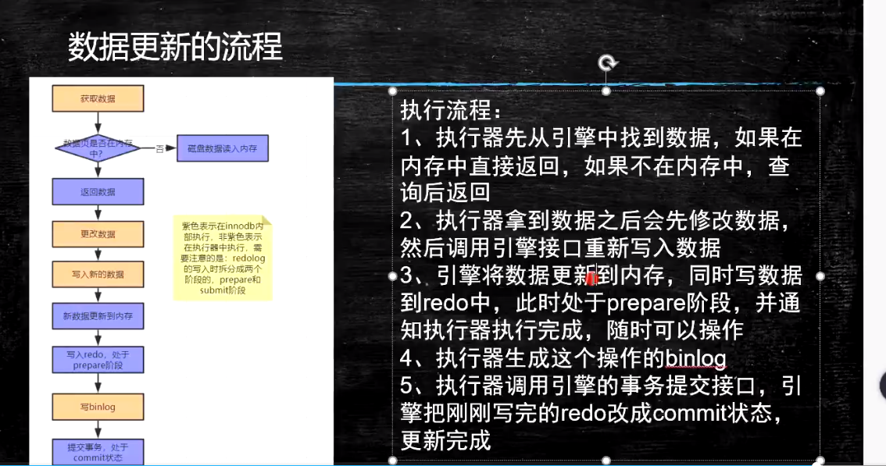
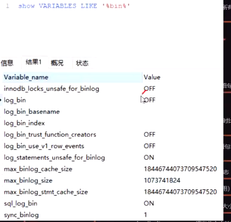
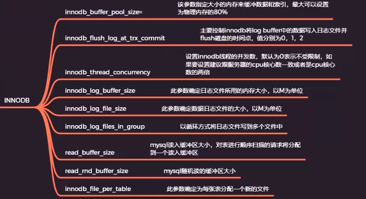

#### 服务器参数设置

my.ini文件

##### general


##### character


##### connection


查看mysql最大连接数设置：

```
#查看最大连接数
show variables like '%max_connections%';
#设置最大连接数
set global max_connections=1024;
#查看进程
show processlist;
#查看back_log配置
show variables like '%back_log%';
```







##### log

```
#显示慢查询日志配置
show variables like '%slow_query_log%';
#查看慢查询日志
select * from mysql.slow_log limit 1;
```





ACID: A(原子性)是通过undo_log实现，C(一致性)是通过原子性、隔离性、持久性来实现的，I(隔离性)中有不同的事务隔离级别，而隔离级别是通过锁实现的，D(持久性)是通过redo_log来实现的。





```
show variables '%log%';
```



##### cache

##### innodb 

