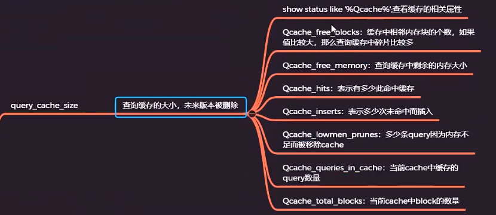
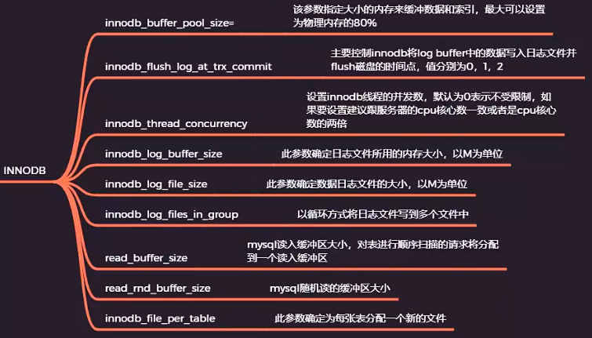

#### 服务器参数设置


```
#查询是否开启查询日志记录
show variables like '%general_log%';
```

##### cache




##### innodb



# mysql的锁机制

### 1、MySQL锁的基本介绍

​		**锁是计算机协调多个进程或线程并发访问某一资源的机制。**在数据库中，除传统的 计算资源（如CPU、RAM、I/O等）的争用以外，数据也是一种供许多用户共享的资源。如何保证数据并发访问的一致性、有效性是所有数据库必须解决的一 个问题，锁冲突也是影响数据库并发访问性能的一个重要因素。从这个角度来说，锁对数据库而言显得尤其重要，也更加复杂。

​		相对其他数据库而言，MySQL的锁机制比较简单，其最 显著的特点是不同的**存储引擎**支持不同的锁机制。比如，MyISAM和MEMORY存储引擎采用的是表级锁（table-level locking）；InnoDB存储引擎既支持行级锁（row-level locking），也支持表级锁，但默认情况下是采用行级锁。 

​		**表级锁：**开销小，加锁快；不会出现死锁；锁定粒度大，发生锁冲突的概率最高，并发度最低。 
​		**行级锁：**开销大，加锁慢；会出现死锁；锁定粒度最小，发生锁冲突的概率最低，并发度也最高。  

​		从上述特点可见，很难笼统地说哪种锁更好，只能就具体应用的特点来说哪种锁更合适！仅从锁的角度 来说：表级锁更适合于以查询为主，只有少量按索引条件更新数据的应用，如Web应用；而行级锁则更适合于有大量按索引条件并发更新少量不同数据，同时又有 并发查询的应用，如一些在线事务处理（OLTP）系统。 

### 2、MyISAM表锁

MySQL的表级锁有两种模式：**表共享读锁（Table Read Lock）**和**表独占写锁（Table Write Lock）**。  

对MyISAM表的读操作，不会阻塞其他用户对同一表的读请求，但会阻塞对同一表的写请求；对 MyISAM表的写操作，则会阻塞其他用户对同一表的读和写操作；MyISAM表的读操作与写操作之间，以及写操作之间是串行的！ 

建表语句：

```sql
CREATE TABLE `mylock` (
  `id` int(11) NOT NULL AUTO_INCREMENT,
  `NAME` varchar(20) DEFAULT NULL,
  PRIMARY KEY (`id`)
) ENGINE=MyISAM DEFAULT CHARSET=utf8;

INSERT INTO `mylock` (`id`, `NAME`) VALUES ('1', 'a');
INSERT INTO `mylock` (`id`, `NAME`) VALUES ('2', 'b');
INSERT INTO `mylock` (`id`, `NAME`) VALUES ('3', 'c');
INSERT INTO `mylock` (`id`, `NAME`) VALUES ('4', 'd');
```

**MyISAM写锁阻塞读的案例：**

​		当一个线程获得对一个表的写锁之后，只有持有锁的线程可以对表进行更新操作。其他线程的读写操作都会等待，直到锁释放为止。

|                           session1                           |                         session2                          |
| :----------------------------------------------------------: | :-------------------------------------------------------: |
|       获取表的write锁定<br />lock table mylock write;        |                                                           |
| 当前session对表的查询，插入，更新操作都可以执行<br />select * from mylock;<br />insert into mylock values(5,'e'); | 当前session对表的查询会被阻塞<br />select * from mylock； |
|                释放锁：<br />unlock tables；                 |          当前session能够立刻执行，并返回对应结果          |

**MyISAM读阻塞写的案例：**

​		一个session使用lock table给表加读锁，这个session可以锁定表中的记录，但更新和访问其他表都会提示错误，同时，另一个session可以查询表中的记录，但更新就会出现锁等待。

|                           session1                           |                           session2                           |
| :----------------------------------------------------------: | :----------------------------------------------------------: |
|        获得表的read锁定<br />lock table mylock read;         |                                                              |
|   当前session可以查询该表记录：<br />select * from mylock;   |   当前session可以查询该表记录：<br />select * from mylock;   |
| 当前session不能查询没有锁定的表<br />select * from person<br />Table 'person' was not locked with LOCK TABLES | 当前session可以查询或者更新未锁定的表<br />select * from mylock<br />insert into person values(1,'zhangsan'); |
| 当前session插入或者更新表会提示错误<br />insert into mylock values(6,'f')<br />Table 'mylock' was locked with a READ lock and can't be updated<br />update mylock set name='aa' where id = 1;<br />Table 'mylock' was locked with a READ lock and can't be updated | 当前session插入数据会等待获得锁<br />insert into mylock values(6,'f'); |
|                  释放锁<br />unlock tables;                  |                       获得锁，更新成功                       |

### 注意:

**MyISAM在执行查询语句之前，会自动给涉及的所有表加读锁，在执行更新操作前，会自动给涉及的表加写锁，这个过程并不需要用户干预，因此用户一般不需要使用命令来显式加锁，上例中的加锁时为了演示效果。**

**MyISAM的并发插入问题**

MyISAM表的读和写是串行的，这是就总体而言的，在一定条件下，MyISAM也支持查询和插入操作的并发执行

|                           session1                           |                           session2                           |
| :----------------------------------------------------------: | :----------------------------------------------------------: |
|   获取表的read local锁定<br />lock table mylock read local   |                                                              |
| 当前session不能对表进行更新或者插入操作<br />insert into mylock values(6,'f')<br />Table 'mylock' was locked with a READ lock and can't be updated<br />update mylock set name='aa' where id = 1;<br />Table 'mylock' was locked with a READ lock and can't be updated |    其他session可以查询该表的记录<br />select* from mylock    |
| 当前session不能查询没有锁定的表<br />select * from person<br />Table 'person' was not locked with LOCK TABLES | 其他session可以进行插入操作，但是更新会阻塞<br />update mylock set name = 'aa' where id = 1; |
|          当前session不能访问其他session插入的记录；          |                                                              |
|                  释放锁资源：unlock tables                   |               当前session获取锁，更新操作完成                |
|           当前session可以查看其他session插入的记录           |                                                              |

 可以通过检查table_locks_waited和table_locks_immediate状态变量来分析系统上的表锁定争夺： 

```sql
mysql> show status like 'table_locks%';
+-----------------------+-------+
| Variable_name         | Value |
+-----------------------+-------+
| Table_locks_immediate | 352   |
| Table_locks_waited    | 2     |
+-----------------------+-------+
--如果Table_locks_waited的值比较高，则说明存在着较严重的表级锁争用情况。
```

**InnoDB锁**

**1、事务及其ACID属性**

事务是由一组SQL语句组成的逻辑处理单元，事务具有4属性，通常称为事务的ACID属性。

原子性（Actomicity）：事务是一个原子操作单元，其对数据的修改，要么全都执行，要么全都不执行。
一致性（Consistent）：在事务开始和完成时，数据都必须保持一致状态。
隔离性（Isolation）：数据库系统提供一定的隔离机制，保证事务在不受外部并发操作影响的“独立”环境执行。
持久性（Durable）：事务完成之后，它对于数据的修改是永久性的，即使出现系统故障也能够保持。

**2、并发事务带来的问题**

相对于串行处理来说，并发事务处理能大大增加数据库资源的利用率，提高数据库系统的事务吞吐量，从而可以支持更多用户的并发操作，但与此同时，会带来一下问题：

**脏读**： 一个事务正在对一条记录做修改，在这个事务并提交前，这条记录的数据就处于不一致状态；这时，另一个事务也来读取同一条记录，如果不加控制，第二个事务读取了这些“脏”的数据，并据此做进一步的处理，就会产生未提交的数据依赖关系。这种现象被形象地叫做“脏读” 

**不可重复读**：一个事务在读取某些数据已经发生了改变、或某些记录已经被删除了！这种现象叫做“不可重复读”。 

**幻读**： 一个事务按相同的查询条件重新读取以前检索过的数据，却发现其他事务插入了满足其查询条件的新数据，这种现象就称为“幻读” 

上述出现的问题都是数据库读一致性的问题，可以通过事务的隔离机制来进行保证。

数据库的事务隔离越严格，并发副作用就越小，但付出的代价也就越大，因为事务隔离本质上就是使事务在一定程度上串行化，需要根据具体的业务需求来决定使用哪种隔离级别

|                  | 脏读 | 不可重复读 | 幻读 |
| :--------------: | :--: | :--------: | :--: |
| read uncommitted |  √   |     √      |  √   |
|  read committed  |      |     √      |  √   |
| repeatable read  |      |            |  √   |
|   serializable   |      |            |      |

 可以通过检查InnoDB_row_lock状态变量来分析系统上的行锁的争夺情况： 

```sql
mysql> show status like 'innodb_row_lock%';
+-------------------------------+-------+
| Variable_name                 | Value |
+-------------------------------+-------+
| Innodb_row_lock_current_waits | 0     |
| Innodb_row_lock_time          | 18702 |
| Innodb_row_lock_time_avg      | 18702 |
| Innodb_row_lock_time_max      | 18702 |
| Innodb_row_lock_waits         | 1     |
+-------------------------------+-------+
--如果发现锁争用比较严重，如InnoDB_row_lock_waits和InnoDB_row_lock_time_avg的值比较高
```

**3、InnoDB的行锁模式及加锁方法**

​		**共享锁（s）**：又称读锁。允许一个事务去读一行，阻止其他事务获得相同数据集的排他锁。若事务T对数据对象A加上S锁，则事务T可以读A但不能修改A，其他事务只能再对A加S锁，而不能加X锁，直到T释放A上的S锁。这保证了其他事务可以读A，但在T释放A上的S锁之前不能对A做任何修改。
​		**排他锁（x）**：又称写锁。允许获取排他锁的事务更新数据，阻止其他事务取得相同的数据集共享读锁和排他写锁。若事务T对数据对象A加上X锁，事务T可以读A也可以修改A，其他事务不能再对A加任何锁，直到T释放A上的锁。

​		mysql InnoDB引擎默认的修改数据语句：**update,delete,insert都会自动给涉及到的数据加上排他锁，select语句默认不会加任何锁类型**，如果加排他锁可以使用select …for update语句，加共享锁可以使用select … lock in share mode语句。**所以加过排他锁的数据行在其他事务中是不能修改数据的，也不能通过for update和lock in share mode锁的方式查询数据，但可以直接通过select …from…查询数据，因为普通查询没有任何锁机制。** 

**InnoDB行锁实现方式**

​		InnoDB行锁是通过给**索引**上的索引项加锁来实现的，这一点MySQL与Oracle不同，后者是通过在数据块中对相应数据行加锁来实现的。InnoDB这种行锁实现特点意味着：只有通过索引条件检索数据，InnoDB才使用行级锁，**否则，InnoDB将使用表锁！**  

1、在不通过索引条件查询的时候，innodb使用的是表锁而不是行锁

```sql
create table tab_no_index(id int,name varchar(10)) engine=innodb;
insert into tab_no_index values(1,'1'),(2,'2'),(3,'3'),(4,'4');
```

|                           session1                           |                           session2                           |
| :----------------------------------------------------------: | :----------------------------------------------------------: |
| set autocommit=0<br />select * from tab_no_index where id = 1; | set autocommit=0<br />select * from tab_no_index where id =2 |
|      select * from tab_no_index where id = 1 for update      |                                                              |
|                                                              |     select * from tab_no_index where id = 2 for update;      |

session1只给一行加了排他锁，但是session2在请求其他行的排他锁的时候，会出现锁等待。原因是在没有索引的情况下，innodb只能使用表锁。

2、创建带索引的表进行条件查询，innodb使用的是行锁

```sql
create table tab_with_index(id int,name varchar(10)) engine=innodb;
alter table tab_with_index add index id(id);
insert into tab_with_index values(1,'1'),(2,'2'),(3,'3'),(4,'4');
```

|                           session1                           |                           session2                           |
| :----------------------------------------------------------: | :----------------------------------------------------------: |
| set autocommit=0<br />select * from tab_with_indexwhere id = 1; | set autocommit=0<br />select * from tab_with_indexwhere id =2 |
|     select * from tab_with_indexwhere id = 1 for update      |                                                              |
|                                                              |     select * from tab_with_indexwhere id = 2 for update;     |

3、由于mysql的行锁是针对索引加的锁，不是针对记录加的锁，所以虽然是访问不同行的记录，但是依然无法访问到具体的数据

```sql
insert into tab_with_index  values(1,'4');
```

|                           session1                           |                           session2                           |
| :----------------------------------------------------------: | :----------------------------------------------------------: |
|                       set autocommit=0                       |                       set autocommit=0                       |
| select * from tab_with_index where id = 1 and name='1' for update |                                                              |
|                                                              | select * from tab_with_index where id = 1 and name='4' for update<br />虽然session2访问的是和session1不同的记录，但是因为使用了相同的索引，所以需要等待锁 |

### 总结

**对于MyISAM的表锁，主要讨论了以下几点：** 
（1）共享读锁（S）之间是兼容的，但共享读锁（S）与排他写锁（X）之间，以及排他写锁（X）之间是互斥的，也就是说读和写是串行的。  
（2）在一定条件下，MyISAM允许查询和插入并发执行，我们可以利用这一点来解决应用中对同一表查询和插入的锁争用问题。 
（3）MyISAM默认的锁调度机制是写优先，这并不一定适合所有应用，用户可以通过设置LOW_PRIORITY_UPDATES参数，或在INSERT、UPDATE、DELETE语句中指定LOW_PRIORITY选项来调节读写锁的争用。 
（4）由于表锁的锁定粒度大，读写之间又是串行的，因此，如果更新操作较多，MyISAM表可能会出现严重的锁等待，可以考虑采用InnoDB表来减少锁冲突。

**对于InnoDB表，本文主要讨论了以下几项内容：** 
（1）InnoDB的行锁是基于索引实现的，如果不通过索引访问数据，InnoDB会使用表锁。 
（2）在不同的隔离级别下，InnoDB的锁机制和一致性读策略不同。

在了解InnoDB锁特性后，用户可以通过设计和SQL调整等措施减少锁冲突和死锁，包括：

- 尽量使用较低的隔离级别； 精心设计索引，并尽量使用索引访问数据，使加锁更精确，从而减少锁冲突的机会；
- 选择合理的事务大小，小事务发生锁冲突的几率也更小；
- 给记录集显式加锁时，最好一次性请求足够级别的锁。比如要修改数据的话，最好直接申请排他锁，而不是先申请共享锁，修改时再请求排他锁，这样容易产生死锁；
- 不同的程序访问一组表时，应尽量约定以相同的顺序访问各表，对一个表而言，尽可能以固定的顺序存取表中的行。这样可以大大减少死锁的机会；
- 尽量用相等条件访问数据，这样可以避免间隙锁对并发插入的影响； 不要申请超过实际需要的锁级别；除非必须，查询时不要显示加锁；
- 对于一些特定的事务，可以使用表锁来提高处理速度或减少死锁的可能。

